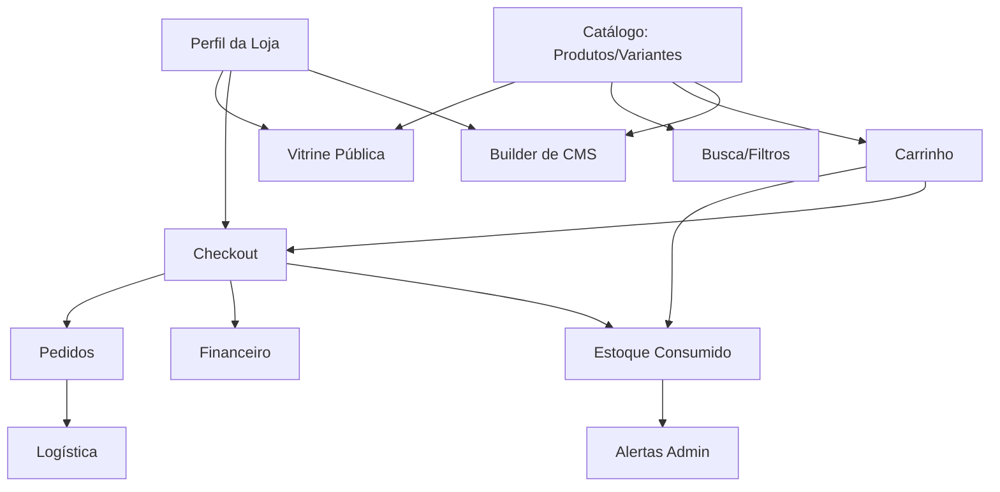

# G3: Gráfico de Dependências (Dependency Graph)

O fluxo principal e crítico deste e-commerce segue uma cadeia restrita. 

**Bloqueadores Comuns:**
- Se `ProductCatalog` retorna erros silenciados (Falso Positivo de BFF), `PublicStorefront` e `BuilderBlocks` quebram e somem da interface.
- Se `Cart` usa preços locais em vez de consultar a fonte no Servidor, `Orders` receberá valores adulterados, o que é inseguro.
